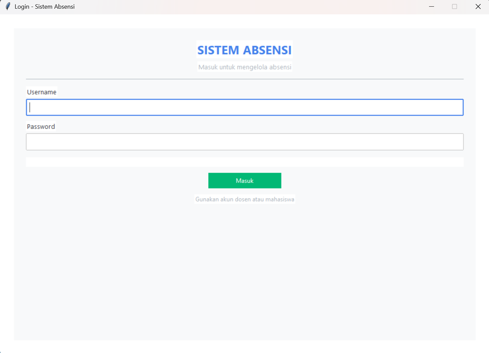
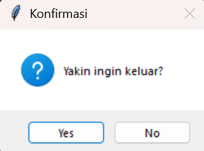
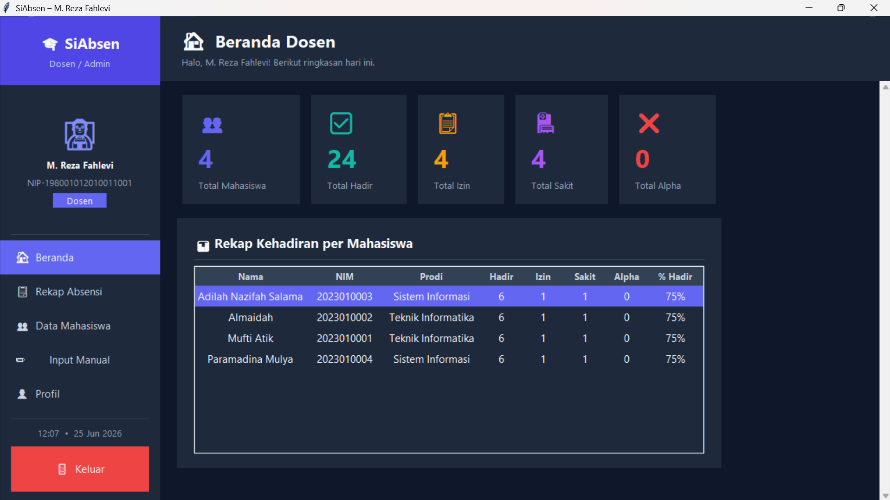
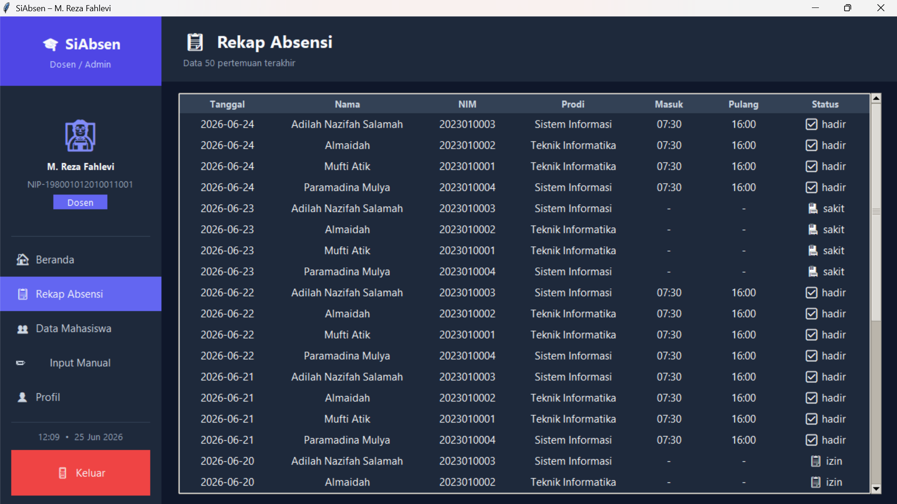
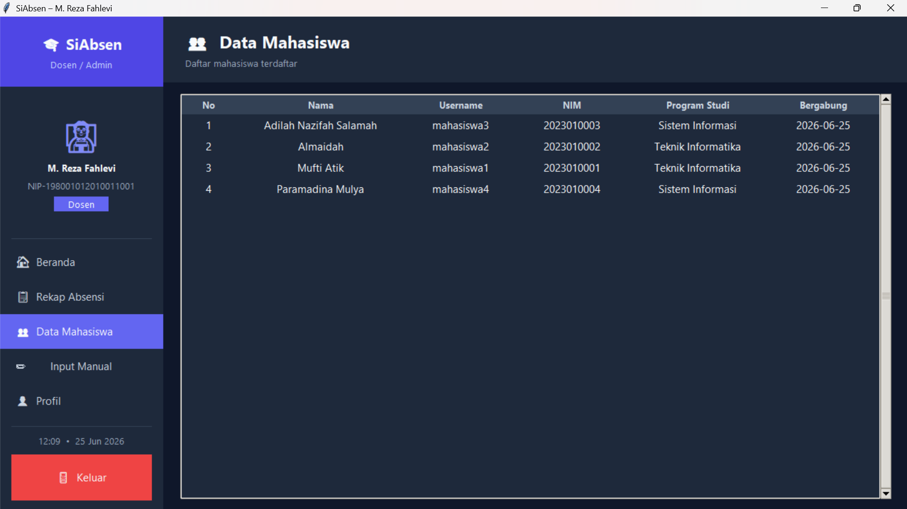
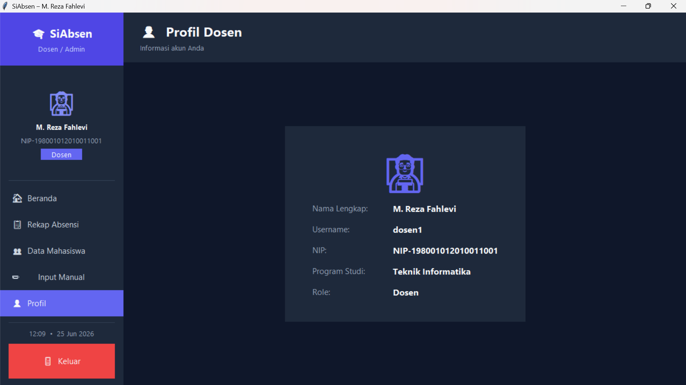
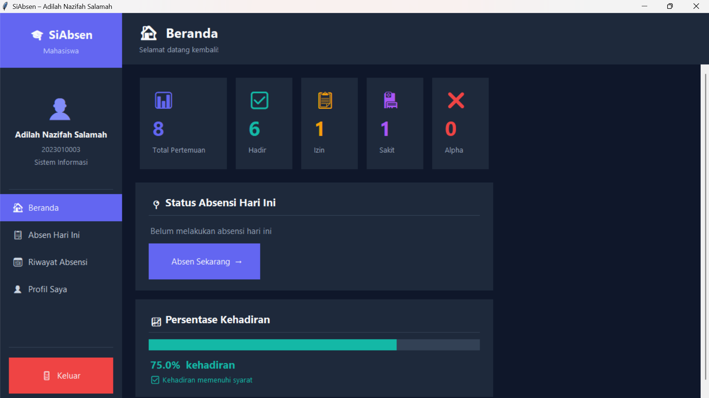
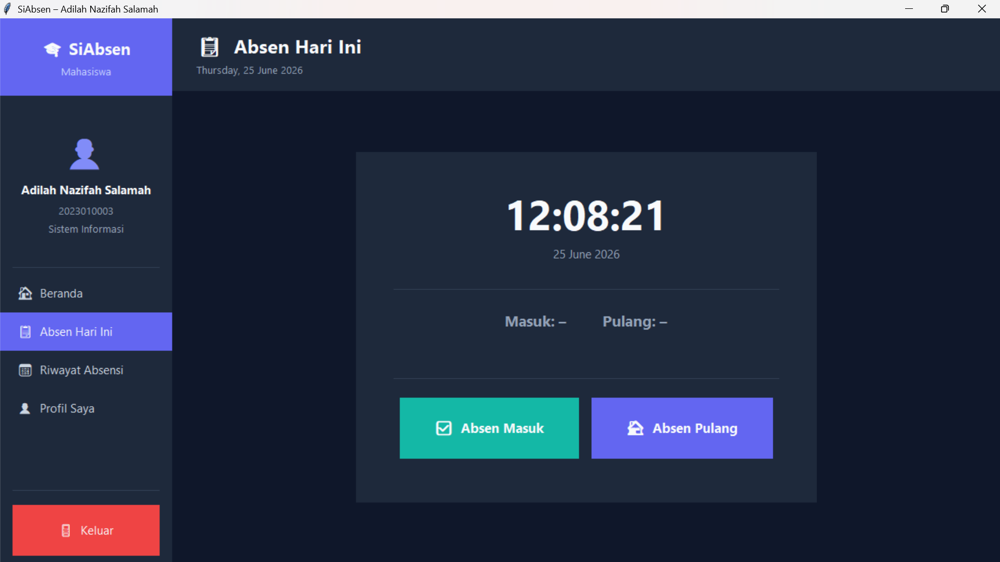
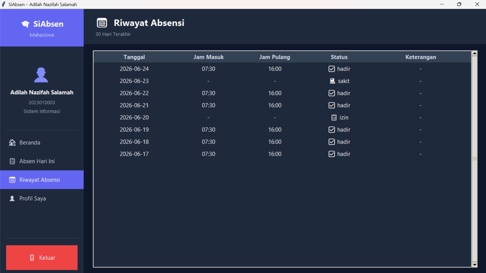
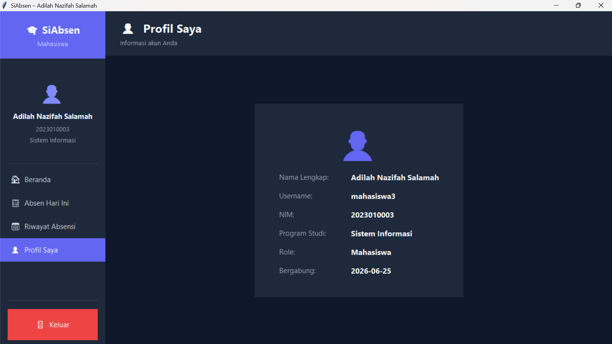

# SiAbsen – Sistem Informasi Absensi Akademik

## Nama : Adilah Nazifah Salamah
## NIM : 23250018

---

## Cara Menjalankan

### 1. Install Python (≥ 3.8)
Tkinter sudah termasuk bawaan Python. Tidak ada dependensi tambahan.

### 2. Jalankan aplikasi
```bash
python main.py
```

---

## Screenshot Hasil
### Tampilan Login

<br>
### Tampilan Logout

<br>
### Tampilan Dashboard Dosen

<br>

<br>

<br>

<br>
### Tampilan Dashboard Mahasiswa

<br>

<br>

<br>

